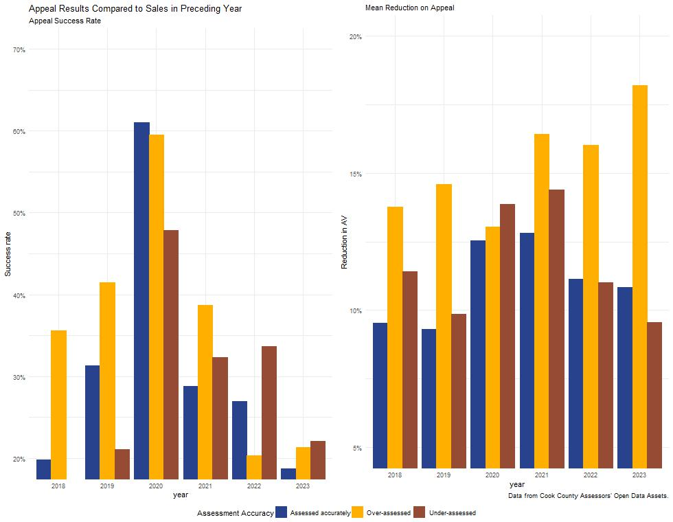

```{r setup, include=FALSE}
knitr::opts_chunk$set(echo = FALSE)

library(dplyr)
```

# Sales adjustment to eliminate time bias

Property values are estimated at a specific date - the lien date - by the Cook County Assessor: January 1st of the re-assessment year. When sales are compared to assessments for the purpose of a ratio study, differences between the sales date and the lien date can 


```{r, chunk1}
load(file = "outputs/table1-sales.rda")
knitr::kable(table1_sales
             , "simple"
             ,  caption = "Property sales and adjusted sale prices for 01-01-108-016-0000"
             , col.names = c("Sale Price", "Sale Date", "Lien Date Price", "Lien Date"
                           , "Prior Year Price", "Prior Year Date"
                           , "Following Year Price", "Following Year Date")
)


```

# Are appeal decisions consistent with sales?

In this section I look at whether appeal decisions are consistent with sales data. I matches each triennial appeal with sales data in the years preceding and succeeding the year the appeal decision was made.I only included properties with a single sale in the preceding or following year. I categorized properties based on whether they were over- or under-assessed by the assessor during the re-assessment; a property was considered over- or under-assessed if ten times its assessed value deviated by more than 10% from its sale price, and accurately assessed if ten times its assessed value was within 10% of its sales price.  

In a functioning appeals system, you would expect to see over-assessed properties winning appeals at much larger rates than correctly and under-assessed properties. You would expect that correctly and under-assessed properties have a very low success rate on appeal. You would expect these results to be insensitive to the use of preceding or succeeding sales. 

The graph below shows appeal success rates and reduction amounts for properties grouped by assessment accuracy. In these graphs we are using sales that occurred in the year following the appeal decision. Observations:
- 2020 is a very unusual year. See discussion of COVID Adjustment
- There is about a 10% difference between appeal success rates of over-assessed properties, and correctly and under-assessed properties.
- Under-assessed and correctly assessed properties have an appeal success rate of about 25%, except in 2020. 
- All properties receive roughly equal reductions in value. 


The graph below shows appeal success rates and reduction amounts for properties grouped by assessment accuracy. In these graphs we are using sales that occurred in the year preceding the appeal decision. Observations:
- In 2018, 2019, and 2021 under-assessed properties were very unlikely to win their appeal, while over-assessed properties have a 20% and 35% chance of winning their appeal.
- 2020 is a very unusual year. See discussion of COVID Adjustment.
- 2022 and 2023 seem unusual. 
- Over-assessed properties consistently win larger reductions, except in 2020. 



More detail


# Transparency recommendations

- Make it easier to [re-create the sales sample](https://github.com/rross0/cc_appeals/issues/10) the CCAO uses for ratio studies. 